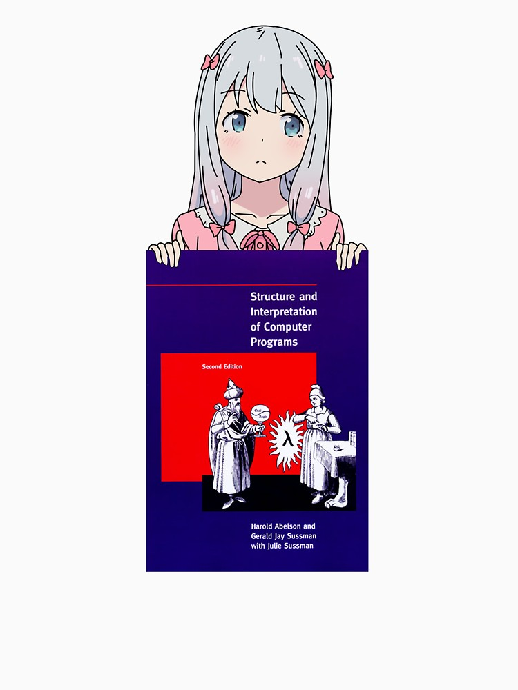

# ExList

[](https://hexdocs.pm/ex_list)



Funny (and inefficient) implementation of linked lists in Elixir language. Do **NOT** use it in real production code!

## Implementation

This project is really good exercise. I implemented linked list data type for Elixir from scratch, without usage of standard build-in Erlang lists. Actually, `ExList` can work on top of 3 backends:

- [:struct](https://github.com/timCF/ex_list/blob/master/lib/ex_list/backends/struct.ex) (default) - it is the most obvious way to define new data type in Elixir
- [:tuple](https://github.com/timCF/ex_list/blob/master/lib/ex_list/backends/tuple.ex) - very short way, more efficient than `:struct`
- [:list](https://github.com/timCF/ex_list/blob/master/lib/ex_list/backends/list.ex) - standard Erlang linked lists, I guess the most efficient way

All other code in package is backend-agnostic, it means that in any place of code we can't say what actually list is (struct? tuple? something else?) - all we only can say that list is:

- `list()` is empty list
- `list(head, tail)` is not empty list where head is something and tail is list

And this information is enough to build all business logic. Let's provide some examples:

```elixir
iex> use ExList # default backend is struct
iex> left = list("Hello", list("beautiful", list()))
iex> right = list("AST", list("world", list()))
iex> full = ExList.concat(left, right)
iex> full == list("Hello", list("beautiful", list("AST", list("world", list()))))
true
iex> ExList.reduce(full, "", fn
  word, "" -> word
  word, acc -> "#{acc} #{word}"
end)
"Hello beautiful AST world"
```

Due to the fact that implementation is based on very simple idea (just `&list/0` and `&list/2`) - we have guarantees of the same results on all other backends:

```elixir
iex> use ExList, backend: :tuple # you can try :list as well
iex> left = list("Hello", list("beautiful", list()))
iex> right = list("AST", list("world", list()))
iex> full = ExList.concat(left, right)
iex> full == list("Hello", list("beautiful", list("AST", list("world", list()))))
true
iex> ExList.reduce(full, "", fn
  word, "" -> word
  word, acc -> "#{acc} #{word}"
end)
"Hello beautiful AST world"
```

## Protocols

Foundation of `:struct` ExList backend is Elixir structure, so we can have polymorphic goodies using Elixir protocols!

```elixir
iex> use ExList, backend: :struct
iex> ex_list = list("hello", list("world", list("stop", list("please", list()))))
iex> ExList.reduce_while(ex_list, 0, &((&1 == "stop") && halt(&2) || cont(&2 + 1)))
2
# Enumerable protocol
iex> Enum.reduce_while(ex_list, 0, &((&1 == "stop") && halt(&2) || cont(&2 + 1)))
2 # words before "stop" word in given list (result is the same)
iex> std_list = Enum.to_list(ex_list)
["hello", "world", "stop", "please"]
iex> Enum.find(ex_list, &(String.length(&1) < 5))
"stop"
# Collectable protocol
iex> ex_list == Enum.into(std_list, list())
true
# String.Chars protocol
iex> to_string(ex_list)
"#ExList<hello, world, stop, please>"
```

## Sigil

Just for better syntax I implemented `~l` sigil for ExList. This sigil is not 100% fair because standard Erlang lists are used in compile-time to parse terms to AST

```elixir
iex> use ExList, backend: :struct
iex> ~l/"hello", "world"/ == list("hello", list("world", list()))
true
```
